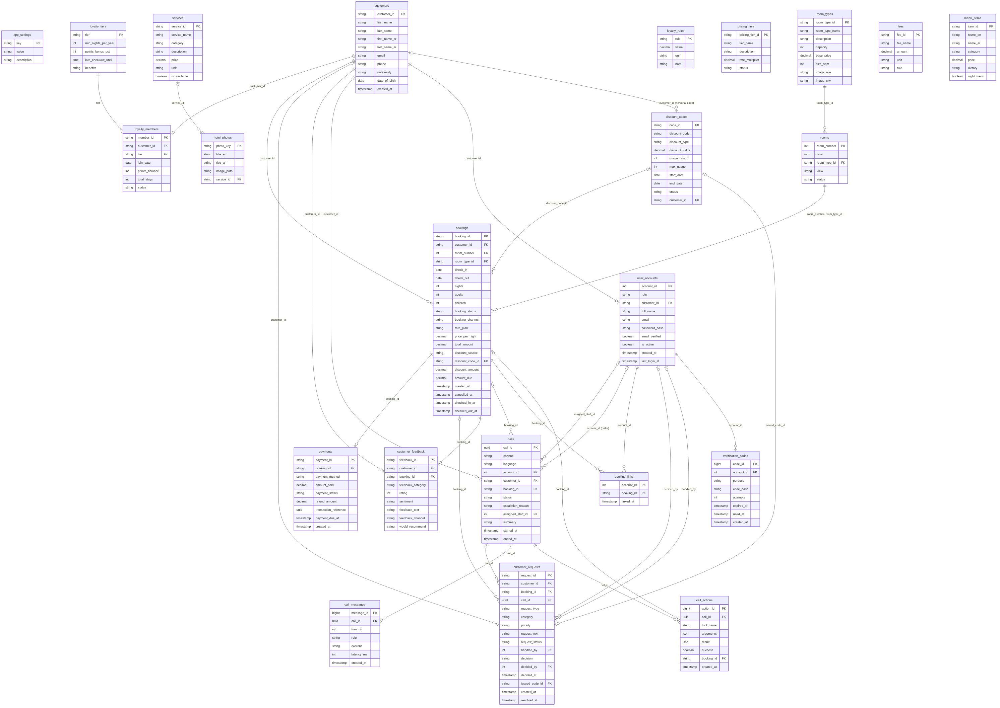
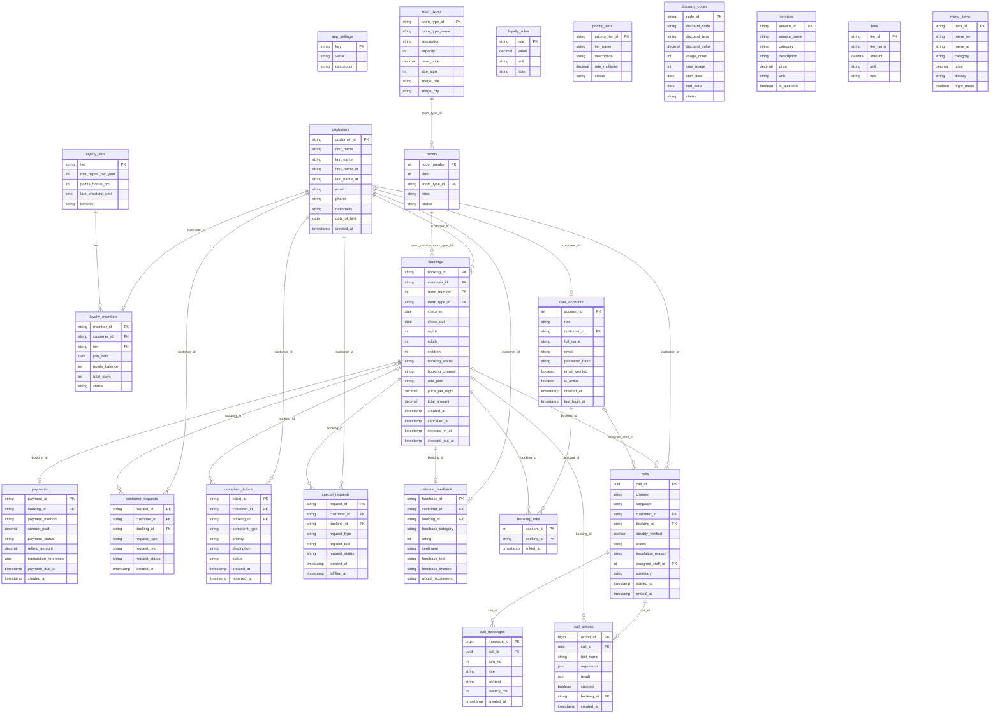

# ERD - Nile Pearl Hotel database

The same diagram as Mermaid (GitHub renders it):

```mermaid
erDiagram
    app_settings {
        string key PK
        string value
        string description
    }
    room_types {
        string room_type_id PK
        string room_type_name
        string description
        int capacity
        decimal base_price
        int size_sqm
        string image_nile
        string image_city
    }
    rooms {
        int room_number PK
        int floor
        string room_type_id FK
        string view
        string status
    }
    customers {
        string customer_id PK
        string first_name
        string last_name
        string first_name_ar
        string last_name_ar
        string email
        string phone
        string nationality
        date date_of_birth
        timestamp created_at
    }
    loyalty_tiers {
        string tier PK
        int min_nights_per_year
        int points_bonus_pct
        time late_checkout_until
        string benefits
    }
    loyalty_rules {
        string rule PK
        decimal value
        string unit
        string note
    }
    loyalty_members {
        string member_id PK
        string customer_id FK
        string tier FK
        date join_date
        int points_balance
        int total_stays
        string status
    }
    pricing_tiers {
        string pricing_tier_id PK
        string tier_name
        string description
        decimal rate_multiplier
        string status
    }
    discount_codes {
        string code_id PK
        string discount_code
        string discount_type
        decimal discount_value
        int usage_count
        int max_usage
        date start_date
        date end_date
        string status
    }
    services {
        string service_id PK
        string service_name
        string category
        string description
        decimal price
        string unit
        boolean is_available
    }
    fees {
        string fee_id PK
        string fee_name
        decimal amount
        string unit
        string rule
    }
    menu_items {
        string item_id PK
        string name_en
        string name_ar
        string category
        decimal price
        string dietary
        boolean night_menu
    }
    bookings {
        string booking_id PK
        string customer_id FK
        int room_number FK
        string room_type_id FK
        date check_in
        date check_out
        int nights
        int adults
        int children
        string booking_status
        string booking_channel
        string rate_plan
        decimal price_per_night
        decimal total_amount
        timestamp created_at
        timestamp cancelled_at
        timestamp checked_in_at
        timestamp checked_out_at
    }
    payments {
        string payment_id PK
        string booking_id FK
        string payment_method
        decimal amount_paid
        string payment_status
        decimal refund_amount
        uuid transaction_reference
        timestamp payment_due_at
        timestamp created_at
    }
    customer_requests {
        string request_id PK
        string customer_id FK
        string booking_id FK
        string request_type
        string request_text
        string request_status
        timestamp created_at
    }
    complaint_tickets {
        string ticket_id PK
        string customer_id FK
        string booking_id FK
        string complaint_type
        string priority
        string description
        string status
        timestamp created_at
        timestamp resolved_at
    }
    special_requests {
        string request_id PK
        string customer_id FK
        string booking_id FK
        string request_type
        string request_text
        string request_status
        timestamp created_at
        timestamp fulfilled_at
    }
    customer_feedback {
        string feedback_id PK
        string customer_id FK
        string booking_id FK
        string feedback_category
        int rating
        string sentiment
        string feedback_text
        string feedback_channel
        string would_recommend
    }
    user_accounts {
        int account_id PK
        string role
        string customer_id FK
        string full_name
        string email
        string password_hash
        boolean email_verified
        boolean is_active
        timestamp created_at
        timestamp last_login_at
    }
    booking_links {
        int account_id PK
        string booking_id PK
        timestamp linked_at
    }
    calls {
        uuid call_id PK
        string channel
        string language
        string customer_id FK
        string booking_id FK
        boolean identity_verified
        string status
        string escalation_reason
        int assigned_staff_id FK
        string summary
        timestamp started_at
        timestamp ended_at
    }
    call_messages {
        bigint message_id PK
        uuid call_id FK
        int turn_no
        string role
        string content
        int latency_ms
        timestamp created_at
    }
    call_actions {
        bigint action_id PK
        uuid call_id FK
        string tool_name
        json arguments
        json result
        boolean success
        string booking_id FK
        timestamp created_at
    }
    room_types ||--o{ rooms : "room_type_id"
    customers ||--o| loyalty_members : "customer_id"
    loyalty_tiers ||--o{ loyalty_members : "tier"
    customers ||--o{ bookings : "customer_id"
    rooms ||--o{ bookings : "room_number, room_type_id"
    bookings ||--o| payments : "booking_id"
    customers ||--o{ customer_requests : "customer_id"
    bookings |o--o{ customer_requests : "booking_id"
    customers ||--o{ complaint_tickets : "customer_id"
    bookings |o--o{ complaint_tickets : "booking_id"
    customers ||--o{ special_requests : "customer_id"
    bookings ||--o{ special_requests : "booking_id"
    customers ||--o| customer_feedback : "customer_id"
    bookings ||--o| customer_feedback : "booking_id"
    customers |o--o{ calls : "customer_id"
    bookings |o--o{ calls : "booking_id"
    user_accounts |o--o{ calls : "assigned_staff_id"
    customers ||--o| user_accounts : "customer_id"
    user_accounts ||--o{ booking_links : "account_id"
    bookings ||--o{ booking_links : "booking_id"
    calls ||--o{ call_messages : "call_id"
    calls ||--o{ call_actions : "call_id"
    bookings |o--o{ call_actions : "booking_id"
```
